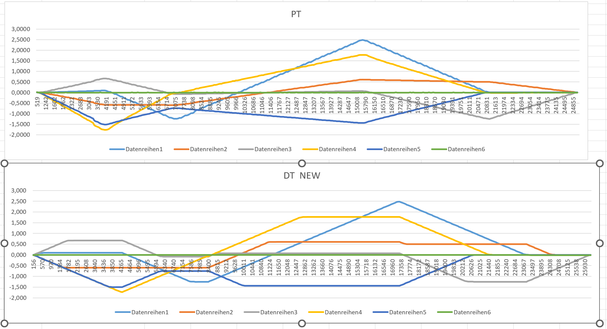
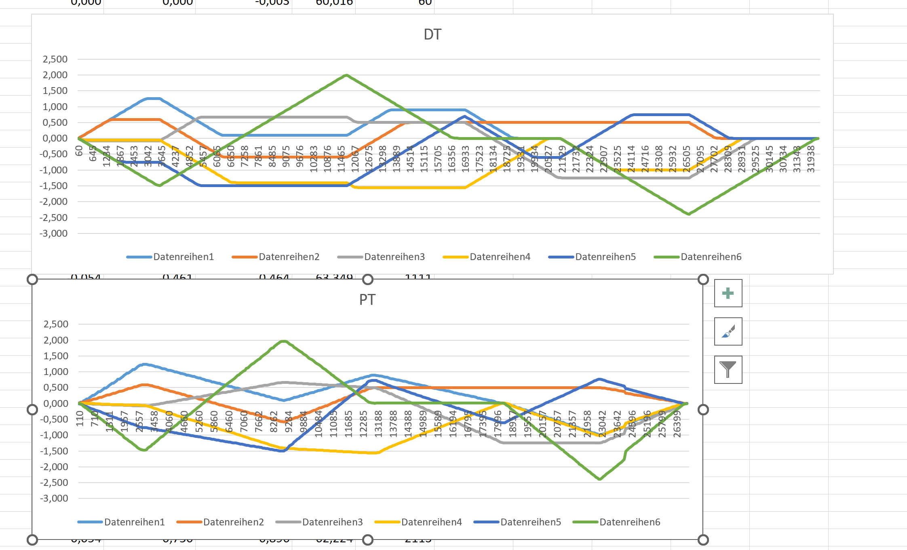

# DigitalTwin_for_Cyber_Physical_Systems_with_Niryo
This repository is to compare the data logs from digital twin platform to real robot

# Physical Twin
The required files and properties to run for physical twin are:
- Niryo Ned robot
- Scripts under `Physical_Twin_File/` folder

### Steps:

Sure! Here is the rephrased version of the given instructions in markdown format:

1. Before starting, make sure to have the updated firmware of the Niryo Ned robot. You can obtain the firmware from the [Niryo Studio website](https://docs.niryo.com/dev/pyniryo/v1.1.2/en/source/setup/installation.html).

2. The scenarios are defined within the `robot_movement.py` file. You can run any scenario by calling the script with the appropriate keyword arguments, ranging from (1 to 4). For example, to execute scenario 1, use the following command: `robot_movement.py 1`.

3. For logging the data, you can use the `get_logs.py` script with two keyword arguments. The first argument represents the scenario number (1 to 4), and the second argument represents the iteration number (1 to 5). To log data for scenario 1 and iteration 1, use the command: `get_logs.py 1 1`.

4. This will create a log file named `scenario1_iteration1.txt` in the current folder.

5. If you want to include your own scenario just add your scenario to the `robot_movement.py` file and call it with the appropriate keyword argument. eg:

```
# Scenario 1
scenarios = [
                [
                    [0, 0, 0, 0, 0, 0],
                    [0.096, -0.592, 0.673, -1.738, -1.499, 0.003],
                    [-1.253, -0.592, -0.079, -0.054, -0.750, 0.003],
                    [2.495, 0.610, 0.074, 1.770, -1.441, 0.003],
                    [0.000, 0.500, -1.250, 0.000, -0.003, 0.003],
                    [0, 0, 0, 0, 0, 0]
                ],
                <add your won scenario>
            ]
```

# Digital Twin
### Requirements:
- Webots 2023a https://github.com/cyberbotics/webots/releases/tag/R2023a
- URDF model of Niryo Ned robot
- urdf and .py under `Digital_Twin_File/` folder

### Steps:
1. Open Webots and load the `Niryo_Ned.wbt` file or else create new Niryo Ned robot and load the `Niryo_Ned.urdf` file.
2. Load the `webots_ned_controll.py` under `Digital_Twin_Files`.
3. And run the `webots_ned_controll.py` file.
4. Logs will be automatically saved in current dir with name `scenario1_run_1.txt` format.


# Target Position

There are 4 Scenario for with seperate individual target position

Eg: Scenario 1
```
# Scenario 1
[
[0, 0, 0, 0, 0, 0],
[0.096, -0.592, 0.673, -1.738, -1.499, 0.003],
[-1.253, -0.592, -0.079, -0.054, -0.750, 0.003],
[2.495, 0.610, 0.074, 1.770, -1.441, 0.003],
[0.000, 0.500, -1.250, 0.000, -0.003, 0.003],
[0, 0, 0, 0, 0, 0]
],
```

# Log Files
Theses has logs of each scenarios for 5 iterations

eg:
'''[-0.0, -0.0, 0.0, 0.0, -0.0, 0.0] 56.456'''
explains
position of motor m1, m2, m3, m4, m5, m6 and at end 56.45 represents the 'Time difference' between previous logging line

### Some Comparisions:

#### Scenario 1 PT vs DT


#### Scenario 3 PT vs DT

